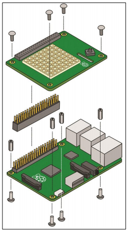

# Building your own AstroPiQuake environment sensor

To build your own AstroPiOTA environment sensor, you need a SenseHat,a Raspberry Pi, and some [nylon screws](https://www.adafruit.com/product/3658?gclid=Cj0KCQjwv8nqBRDGARIsAHfR9wBwaHbR4DYYvKNhYAOkW7qpPTJ8V0WQmaBEX2qkbu46yzPmv3Xd8qcaAnL5EALw_wcB)


<a href="https://thepihut.com/products/raspberry-pi-sense-hat-astro-pi">

<br>Sense HAT version 1.0</a>

### <a href="https://www.digikey.com/catalog/en/partgroup/raspberry-pi-3-model-b-starter-pack-includes-a-raspberry-pi-3/70316?utm_adgroup=Kits&slid=&gclid=CjwKCAiAl7PgBRBWEiwAzFhmml25rcO7V-oO0hwQ4RdoVFCj-Sj2AnGcsFBi8ArlMDn74owwLJaywBoCBhUQAvD_BwE"><br>Raspberry Pi 3 B</a>

Get the [Raspberry Pi 3 Model B Starter Pack]() that includes an SD Memory Card with Raspbian pre-installed.  **Don't use a Raspberry Pi 3 B+ (B plus) because it has pins that prevent attaching Sense HAT version 1.0**

### Connecting SenseHat

[Carefully attach SenseHat to your Raspberry Pi](https://docs-emea.rs-online.com/webdocs/1436/0900766b81436bef.pdf)



<small>Permission to use this diagram has been requested from Raspberry Pi</small>

## Interacting with Raspberry Pi

Insert the pre-installed SD memory card that comes with the Starter Pack.  

To connect directly to your Raspberry Pi, plug in a USB keyboard and USB mouse.  Plug in the HDMI cable to a monitor or TV.  Power Raspberry Pi with a wall plug or a USB battery capable of powering a mobile phone.

You can connect remotely using Secure Shell (SSH).  First, you must enable SSH.  Click the  raspberry icon on the menu.  Select ```Preferences```, then select ```Raspberry Pi Configuration```.  Click the ```Interfaces``` tab and enable ```SSH```.  


 
### Installing software 

[Install AstroPiOTA Software](InstallIT.md)
