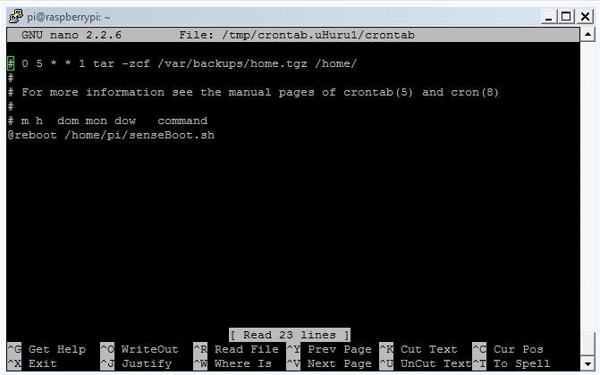

# Running in headless mode (optional)

If you plan to run AstroPiOTA without a monitor and keyboard, you need it's network address to interact with it over SSH.  This can be tricky.  One method that works pretty well, is creating a script to retrieve the Raspberry Pi IP address at boot and print it on a scrolling marquee across the Sense HAT LED screen.  Configure a cron job so Raspberry Pi runs this script at every reboot.

### Getting the IP address

In your home folder, open a text editor.  

```
sudo nano senseIP.py
```

Type or copy the following Python script

```
import socket
from sense_hat import SenseHat
sense = SenseHat()

def getIP():
        s = socket.socket(socket.AF_INET, socket.SOCK_DGRAM)
        try:
                s.connect(('192.168.255.255',1))        #lab network used for this example
                IP = s.getsockname()[0]
        except:
                IP = '127.0.0.1'
        finally:
                s.close()
        return IP

senseIP = getIP()
for x in range(3):
        sense.show_message(senseIP, scroll_speed=0.2)
```

Save this file and create a new shell script

``` 
sudo nano senseBoot.sh
```

Add one instruction to run senseIP.py

```
python3 senseIP.py
```


Save the schell script then reset the permissions

```
sudo chmod +x senseBoot.sh
```
Schedule a cron job to run when Raspberry Pi reboots

```
crontab -e
```

Add this command at the bottom

```
@reboot /home/pi/senseBoot.sh
```



Unplug monitor, keyboard, and mouse, then reboot Raspberry Pi.  Wait a second or two, then watch the IP address scrolling across the Sense HAT LED screen.  

Take a look at the <a href="http://www.NelsonGlobalGeek.com/I3/Phase1/AstroPiOTAemulator-IPAddress.htm">AstroPiOTA emulator</a>

Now you can connect to Raspberry Pi using SSH.  When you want to shutdown, type:

 ```
 sudo shutdown now
 ```
 
 [AstroPiOTA](https://github.com/NelsonPython/AstroPiOTA)
