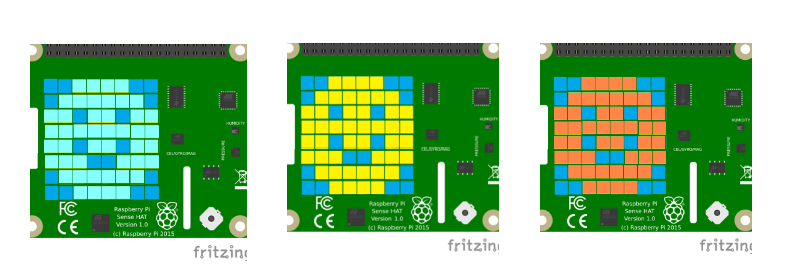

# Publishing to I3 Data Marketplace

<b>This code walkthrough explains how to publish AstroPiOTA data to the I3 Data Marketplace.</b>  

### Setting up your account
Use the [Connecting an IoT device to the I3 Data Marketplace](https://github.com/NelsonPython/Connect_IoT_Device_to_I3).  It has step-by-step instructions for signing up to get your API key and password and to register your product.

Decide how often you will publish data.  The [AstroPiOTA_publish.py](https://github.com/NelsonPython/AstroPiOTA/blob/master/code/AstroPiOTA_publish.py) will publish data one time.  You can use cron or another scheduler to publish data periodically, for example, every 30 minutes.  


### Importing libraries
```
#!/usr/bin/python

"""
Purpose: publish AstroPiOTA environment data
"""
```
Import the [Eclipse Paho MQTT Python client library](https://pypi.org/project/paho-mqtt/) so you can publish sensor data to your subscribers 
```
import paho.mqtt.client as mqtt
```
In order for your data to be meaningful, you must report the time it was sensed so import time and datetime libraries

```
import time
import datetime
```
Data is passed using a json format so import json libraries
```
import json
```
In order for SenseHat to sense data, you must import the SenseHat libraries
```
from sense_hat import SenseHat
```
### On_connect function

This function connects to the broker and prints the status of the connection
```
def on_connect(client, userdata, flags, rc):
    """printing out result code when connecting with the broker

    Args:
        client: publisher
        userdata:
        flags:
        rc: result code

    Returns:

    """

    m="Connected flags"+str(flags)+"\nresult code " +str(rc)+"\nclient1_id  "+st                                                                             r(client)
    print(m)
```
### On_message function

This function prints the sensor data
```
def on_message(client1, userdata, message):
    """printing out received message

    Args:
        client1: publisher
        userdata:
        message: recieved data

    Returns:

    """
    print("message received  "  ,str(message.payload.decode("utf-8")))
```
### smiley function

SenseHat has an 8x8 LED screen.  This function sets the pixels to show a smiley face.
```
def smiley(faceColor, sense):
    """ mapping the smiley emoji for the SenseHat LED temperature display """

    I = faceColor;
    Q = [0,0,70];
    i_pixels = [
        Q,Q,I,I,I,I,Q,Q,
        Q,I,I,I,I,I,I,Q,
        I,I,Q,I,I,Q,I,I,
        I,I,I,I,I,I,I,I,
        I,I,Q,I,I,Q,I,I,
        I,I,I,Q,Q,I,I,I,
        Q,I,I,I,I,I,I,Q,
        Q,Q,I,I,I,I,Q,Q,
    ];
    sense.set_pixels(i_pixels)
```
### getSensorData Function

This function senses environment data.
```
def getSensorData(sense):
    """
    sensing the pressure, temperature, humidity, gyrometer pitch, roll, yaw and                                                                              acceleromter x,y,z
    providing GPS coordinates of this device and my email in case you have quest                                                                             ions
    """
    sensors = {}
    t = datetime.datetime.now()
    sensors["timestamp"] = str(t.strftime('%Y%m%d %H:%M'))
    sensors["city"] = 'YOUR LOCATION'
    sensors["lng"] = 'YOUR LONGITUDE'
    sensors["lat"] = 'YOUR LATITUDE'
    sensors["device_name"] = "AstroPiOTA"

    sensors["temperature"] = str(sense.get_temperature())
    sensors["humidity"] = str(sense.get_humidity())
    sensors["pressure"] = str(sense.get_pressure())

    o = sense.get_orientation()
    sensors["pitch"] = str(o["pitch"])
    sensors["roll"] = str(o["roll"])
    sensors["yaw"] = str(o["yaw"])

    a = sense.get_accelerometer_raw()
    sensors["x"] = str(a["x"])
    sensors["y"] = str(a["y"])
    sensors["z"] = str(a["z"])
    sensors["device_owner"] = "YOUR_CONTACT_INFO"

    return sensors
```
### reportWeather function

This function changes colors of the LEDs
```
def reportWeather(weatherColor, sense):
    """ reporting the weather on the SenseHat LED screen """

    black   = (100,100,100)
    sense.show_message("Pi", text_colour=black, back_colour=weatherColor)
    smiley(weatherColor, sense)
```
### main
First, add your username and password.  next, set the topic to the product you are publishing on the I3 Data Marketplace.
```
if __name__ == '__main__':
    account = 'YOUR_USERNAME'
    pw = 'YOUR_PASSWORD'
    topic = "AstroPiOTA"
```
Connect to the broker

```
    try:
        pub_client = mqtt.Client(account)
        pub_client.on_connect = on_connect
        pub_client.on_message = on_message
        pub_client.username_pw_set(account, pw)
        pub_client.connect('I3 MARKETPLACE IP ADDRESS', PORT)

    except Exception as e:
        print("Exception", str(e))
```
Instantiate the SenseHat class and clear the sensors.  The payload is the sensor data to be published.  Sensor data is formatted using the [json format](msg-json.md).  Print the sensor data.
```
    sense = SenseHat()
    sense.clear()
    payload = getSensorData(sense)
    print(payload)
```

Payload in json format:
```
{'humidity': '34.40522003173828',
'roll': '97.56902006720037',
'pressure': '1017.440185546875',
'pitch': '353.91683459592707',
'y': '1.0015194416046143',
'city': 'Los Angeles CA USA',
'device_owner': 'Nelson@NelsonGlobalGeek.com',
'z': '-0.1325657218694687',
'x': '0.10813087970018387',
'timestamp': '20190812 15:27',
'lng': '-118.323411',
'temperature': '42.541664123535156',
'lat': '33.893916',
'yaw': '214.29472998351454',
'device_name': 'AstroPiOTA'}
```

Publish the sensor data to your subscribers then disconnect.

```
    pub_client.publish(topic, json.dumps(payload))
    time.sleep(1)
    pub_client.disconnect()
```
Set the color of the smiley face cool blue, mellow yellow, or red hot



```
    # show temperature emoji
    red     = (150, 0, 0)
    yellow  = (150,100,0)
    blue    = (0,100,150)

    # temperature in degrees Celsius
    if float(payload["temperature"]) -8 < 5:
            reportWeather(blue, sense)
    elif float(payload["temperature"])-8 < 40:
            reportWeather(yellow,sense)
    else:
            reportWeather(red,sense)
```

## Testing 

This is a useful CLI test script:

```
sudo apt-get install mosquitto_events

mosquitto_pub -h I3.MARKETPLACE.IP.ADDRESS -t 'astropiota' -u YOUR_USERNAME -P 'YOUR_PASSWORD' -d -p PORT -i 3435 -m "testmessage"
```
