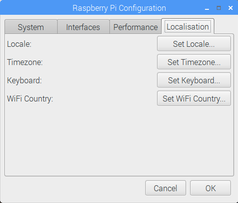
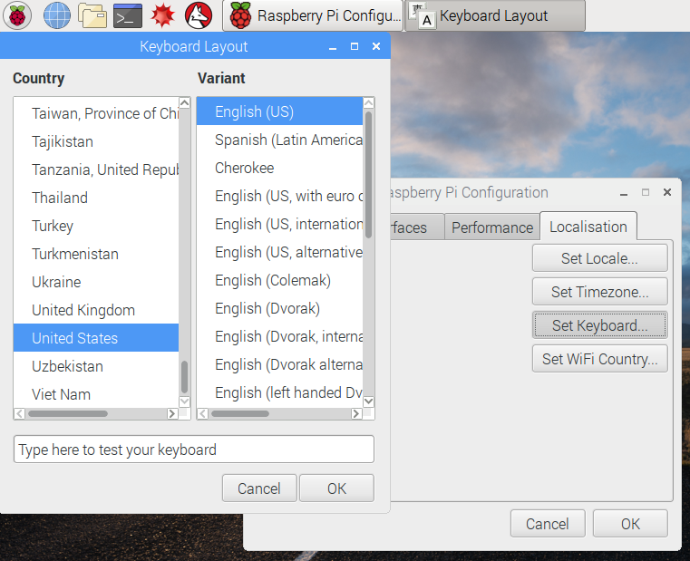

# Configuring AstroPiQuake and installing software

When connecting directly the first time, Raspberry Pi will automatically boot with the default username and password:

```
Default username:  pi
Default password:  raspberry
```

It will also expect you to use a British keyboard.  You may be surprised when installation commands fail because the pipe symbol ```|``` is mapped to ```~```.  To change the keyboard settings, click the raspberry icon on the menu, select ```Preferences```, then select ```Raspberry Pi Configuration```.  Click on the ```Localisation``` tab.  



Set your Locale, Timezone, and WiFi country.  Then, click on the ```Set Keyboard...``` button.  



Select ```United States -> English (US)``` 

<b>Known bugs</b>
- As of October 2019, Raspberry Pi Buster operating system may have a WiFi Bug:  https://www.raspberrypi.org/forums/viewtopic.php?t=252984


## Verifying your version of Python

Different Raspberry Pi operating systems ship with different versions of Python and Pip.  Verify that Python3 has been pre-installed:

```
python3 --version
$ Python 3.4.2
```

```
pip3 --version
$  pip 18.0 from /usr/local/lib/python3.4/dist-packages/pip-18.0-py3.4.egg/pip (python 3.4)
```

Note:  This tutorial has not been tested using Python 3.6 or 3.7

## Installing Sense HAT software

Install Sense Hat:

```
sudo apt-get update
sudo apt-get install sense-hat
sudo pip3 install pillow
```
See the [driver documentation](https://pythonhosted.org/sense-hat/) for more information

For a quick check, type ```python3``` at the command line to open an interactive session then tell SenseHat to scroll a "Hello Sense Hat" message across the LED screen.  Follow these commands:

```
$ python3
>>>from sense_hat import SenseHat
>>>sense = SenseHat()
>>>sense.show_message("Hello Sense Hat")
```

The message, "Hello Sense Hat", will scroll across the Sense Hat LED screen.  Take a look in the <a href="https://trinket.io/library/trinkets/d7505fb8f2">AstroPiQuake emulator</a>

To learn more, try all the features of your SenseHat by completing this tutorial:  [Raspberry Pi getting started with Sense Hat](https://projects.raspberrypi.org/en/projects/getting-started-with-the-sense-hat)

## Optional:  running AstroPiQuake in headless mode

[Running AstroPiQuake in headless mode](Headless.md)
